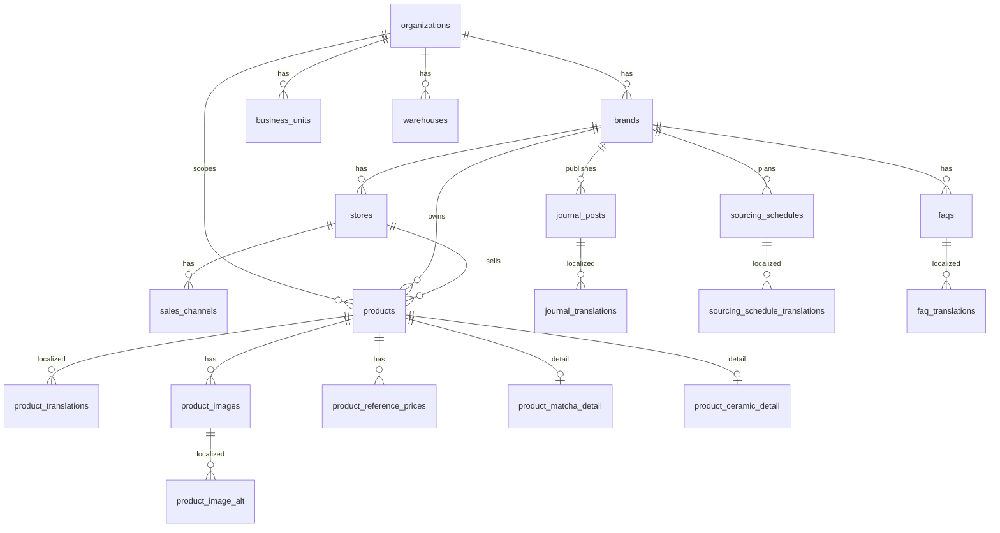
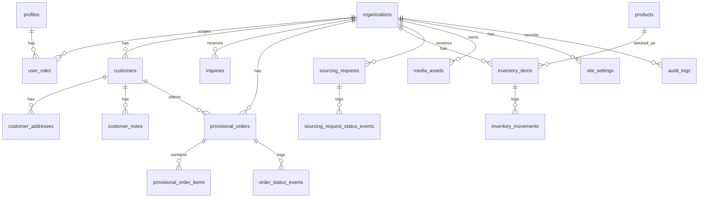
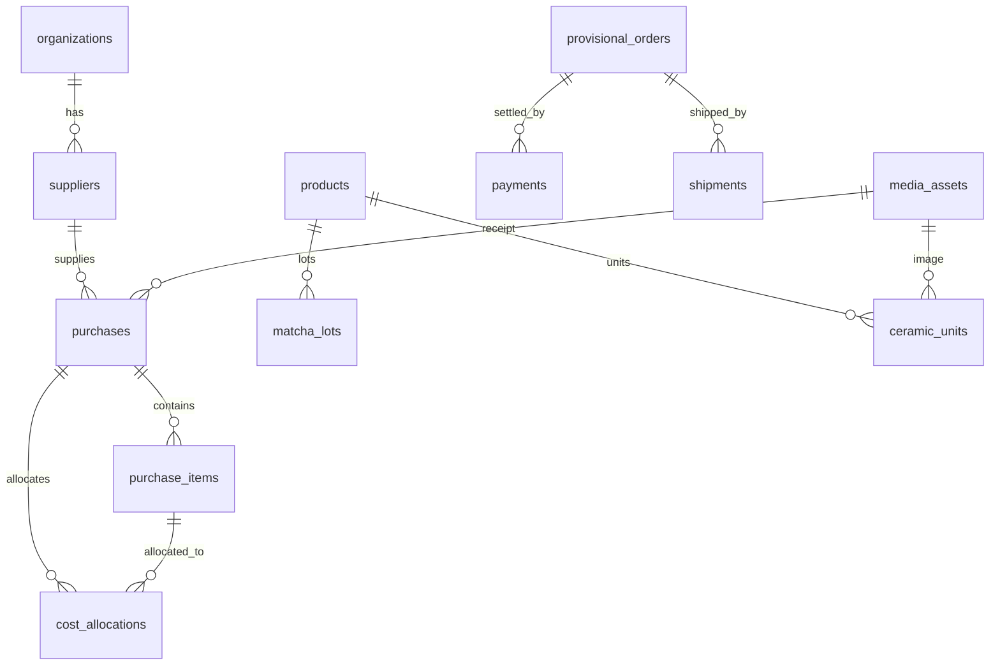

# ER 図 — KAGURAKOJI Commerce Core

主要エンティティと関係（mermaid）。詳細カラムは `migrations/*.sql` を正とする。

## 組織構造・カタログ・公開コンテンツ（0001）

## 運用（0002）

## 仕入・原価・入金・配送・ロット・個体（0003 / Phase 2B）

## 凡例

- すべての主要テーブルは `organization_id` で多テナント境界を持つ（一部は親経由）。
- 金額は `*_minor`(bigint) + `currency`(char3)。
- `*_translations` は `(parent_id, locale)` 複合主キー。
- 機微（原価/利益/口座/顧客全件）は RLS（0004）で owner 限定。
